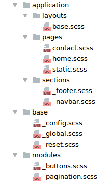

# UpCss

Это методология, которая предоставляет решение по созданию гибкой 
архитектуры CSS-кода. 

---

## Для чего это?

Благодаря масштабируемому и модульному подходу, можно писать более 
качественный CSS-код, упростить его, избегать дублирования, 
облегчить рефакторинг, использовать имеющиеся заготовки, а также 
ускорить процесс обучения новых специалистов.

## Требования

UpCss - не является framework`ом и не требует никаких библиотек для 
загрузки или установки. 

Однако хорошим тоном будет использование предпроцессора [SCSS](http://sass-lang.com)
и менеджера задач для сборки CSS-кода, например [GULP](https://gulpjs.com). 

Обратите внимание, использование данных инструментов не является жестким 
требованием, а скорее рекомендация для простой и быстрой работы. Существует 
множество других технологий, которыми можно воспользоваться.

## Документация

Ознакомьтесь более детально с техническими аспектами UpCss:

* **Предисловие**
    * [Введение](./doc/preface/introduction.md)
    * [Про UpCss](./doc/preface/about.md)
* **UpCss**
    * [Структура](./doc/core/structure.md)
        * [Base](./doc/core/upCss-base.md)
        * [Modules](./doc/core/upCss-modules.md)
        * [Application](./doc/core/upCss-application.md)
            * [Sections](./doc/core/upCss-application.md#sections-Секции)
            * [Layouts](./doc/core/upCss-application.md#layouts-Каркасы)
            * [Pages](./doc/core/upCss-application.md#pages-Страницы)
    * [Общие правила](./doc/core/total-rules.md)
* **Дополнительно**
    * [Работа с селекторами](./doc/additionally/work-with-selectors.md)

## Лицензия

Данный репозиторий опубликован под лицензией MIT. 
Подробную информацию читайте в файле [LICENSE](./LICENSE).