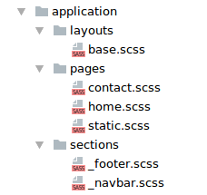

# Application (Приложение)

**application** - Основной каталог со всеми стилями Вашего приложения.

>Совет: Не пытайтесь что-либо переиспользовать из данного каталога.
Исходя из специфик различных дизайнерских подходов, не считая шаблонных решений,
это может быть нецелесообразно.

Директория **application** обычно включает три основные поддиректории:
**sections**, **layouts** и **pages**.

[Общие правила, применяемые к приложению](./total-rules.md#application)


## Sections (Секции)

Основные составляющие приложения. Ими может быть header, footer, sidebar,
navigation и другие секции, которые могут использоваться на разных страницах
приложения.

По сути, все приложение состоит из различных секций, которые собраны с помощью 
каркаса и могут быть изменены на определенных страницах.

Хорошей практикой будет выделить части приложения в секции и сделать их
максимально переиспользуемыми в рамках текущего проекта.
С использованием **layouts** и **pages** появляется возможность манипулировать
стилями для группы страниц или каждой отдельной страницы.

Секция представляет собой блок с произвольным классом:

```html
<div class="header">
...
</div>
```

Созданный файл стилей **application/sections/_header.scss**:

```css
.header {

  // Стили для текущей секции

}
```

> Файлы секций распологаются в каталоге **application/sections/**. 
Каждый файл необходимо именовать начиная с нижнего подчеркивания, 
так-как он является фрагментом, а не полноценной страницей, например: <br>
_header.scss, _footer.scss, _sidebar.scss и тд.


[Общие правила, применяемые к секциям](./total-rules.md#sections)


## Layouts (Каркасы)

Стили, которые необходимы для формирования общего каркаса нескольких страниц
приложения.

Css-код в данной директории необходим для:

* Стилизации группы страниц.
* Модификации различных элементов на нескольких страницах.

Для использования layouts-стилей, необходимо указать определенный класс тегу body,
в html разметке для нужных страниц:

```html
<body class="l-base">
...
</body>
```

Созданный файл стилей **application/layouts/base.scss**:

```css
.l-base {

  // Стили для группы страниц
  // Стили для манипуляции с элементами для группы страниц

}
```


[Общие правила, применяемые к каркасам](./total-rules.md#layouts)


## Pages (Страницы)

Стили, непосредственно, применяемые к конкретным страницам приложения, которые
не могут быть переиспользованы.

Css-код в данной директории необходим для:

* Стилизации конкретной страницы.
* Модификации различных элементов на конкретной странице.

Для использования pages-стилей, на странице приложения должен быть
указан определенный класс для тега body:

```html
<body class="p-home">
...
</body>
```

Созданный файл стилей **application/pages/home.scss**:

```css
.p-home {

  // Стили для текущей страницы
  // Стили для манипуляции с элементами на текущей странице

}
```


[Общие правила, применяемые к каркасам](./total-rules.md#pages)


## Общее представление

Прежде всего необходимо разбить макет на секции. Основное условие, при котором 
часть макета может называться секцией - это использование на более, чем одной странице.


...


### Пример

Структура каталога **application** в простом макете может выглядеть так:



--------

[Вернуться обратно в структуру](./structure.md)

[Вернуться обратно к модулям](./upCss-modules.md)