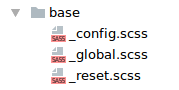

# Базис

Пожалуй каждое приложение может иметь какуе-то общую базу. 
Это может быть framework или отдельные его компоненты,
reset-стили (или normalize-стили), глобальные заготовки,
конфигурации и другое.

Директория **base** предназначена для хранения глобальных стилей, 
компонентов framework`а и конфигурации приложения.

>Совет: Старайтесь правильно структурировать каталог, разместив
в него действительно глобальные стили.

[Общие правила, применяемые к базису](./total-rules.md#Base)

### Пример

Структура каталога **base** в простом макете может выглядеть так:

--------

[Вернуться обратно в структуру](./structure.md)

[Перейти к модулям](./upCss-modules.md)